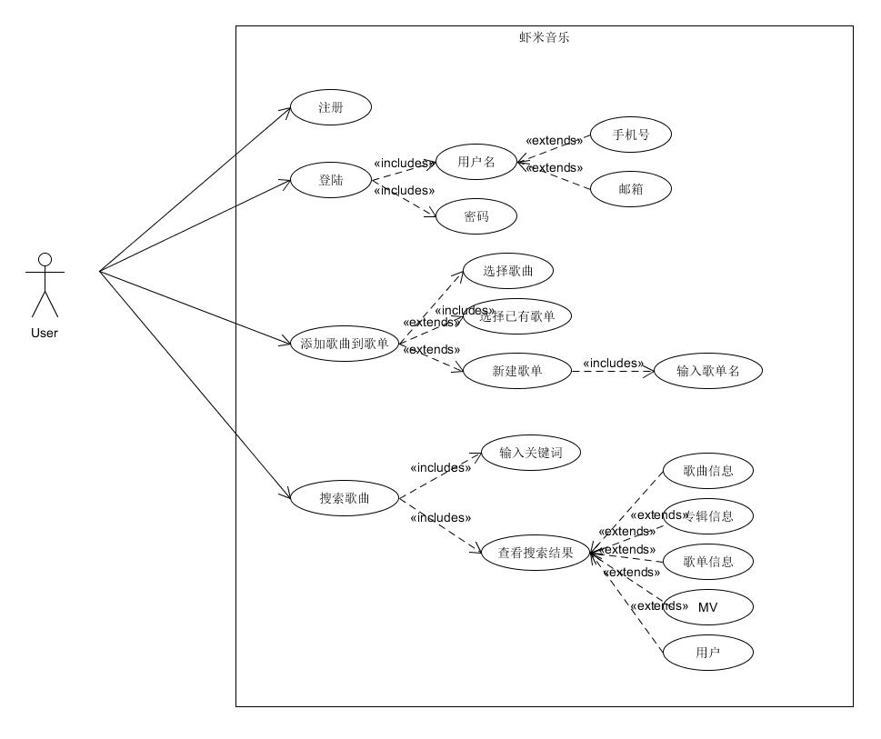
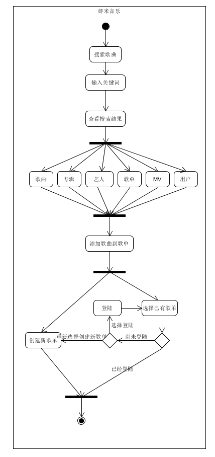
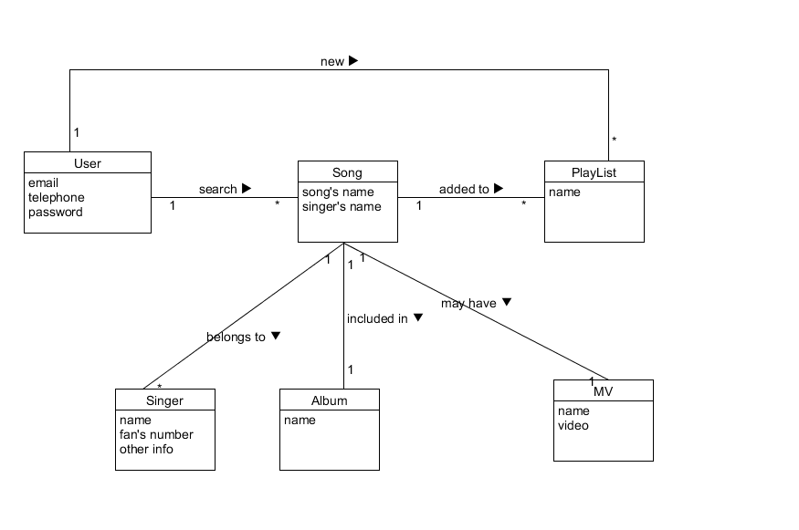
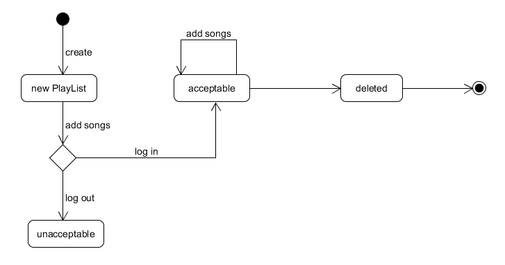
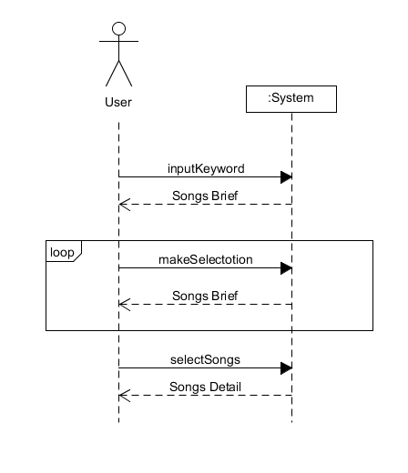
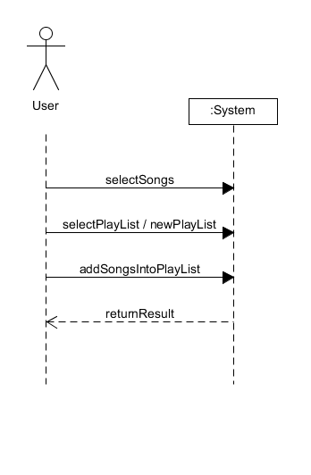

# 系统分析与设计作业九
---  
建模要求文档：[虾米音乐搜索及添加歌曲功能](https://github.com/starpick/dashboard/tree/gh-pages/XX%E5%BB%BA%E6%A8%A1%E7%BB%83%E4%B9%A0)
### 用例图

---
### 活动图

---
### 领域模型

---
### 状态图
以播放列表(PlayList)为对象：
- 用户可以创建一个播放列表
- 如果用户尚未登陆，不能添加歌曲到已有列表
- 如果用户已经登陆，可以添加歌曲到已有列表中
- 用户可以删除列表

**事件有：{create, add songs, log in, log out}**
    
    
**状态有：{new PlayList, accecptable, unaccecptable, deleted}**

---
### 系统顺序图与操作协议
#### 用例主场景之一：搜索歌曲

#### 用例主场景之一：添加歌曲至歌单

#### 操作契约的后置条件
操作：selectPlayList  
交叉引用：用例：添加歌曲至歌单  
前置条件：用户已经登陆  
后置条件：选中该播放列表  
